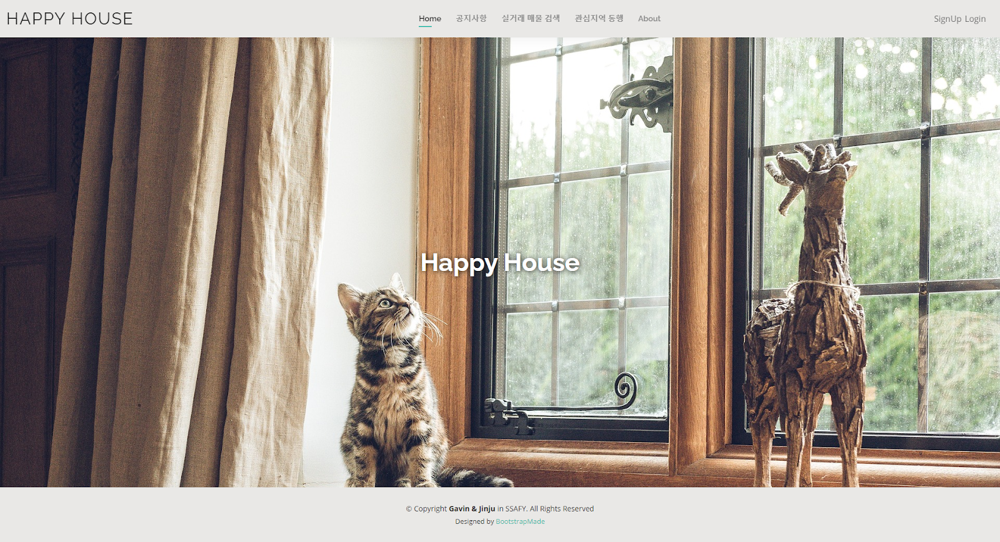
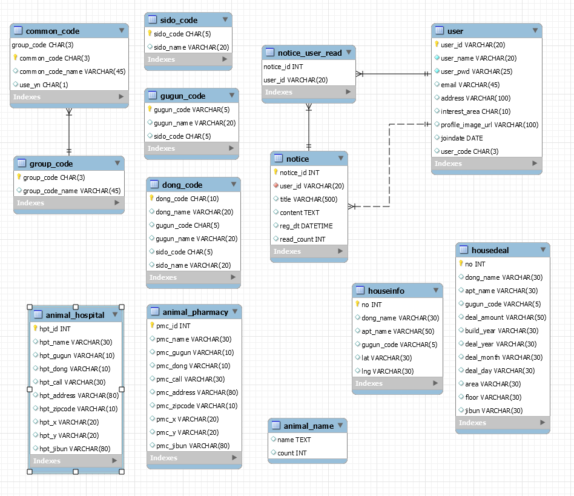
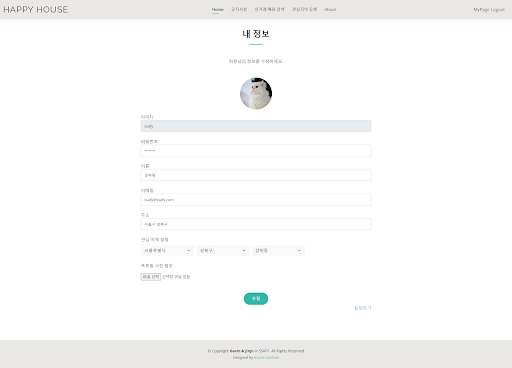
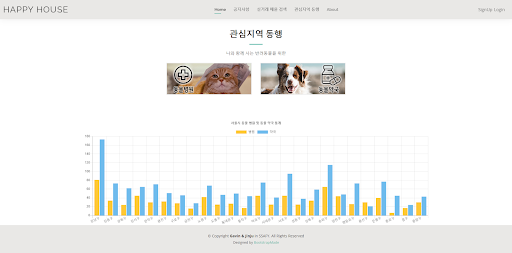
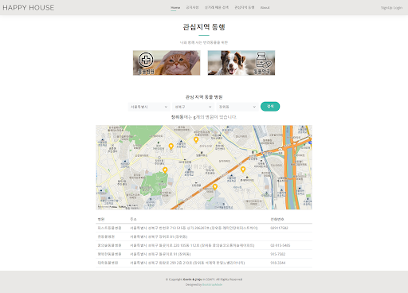
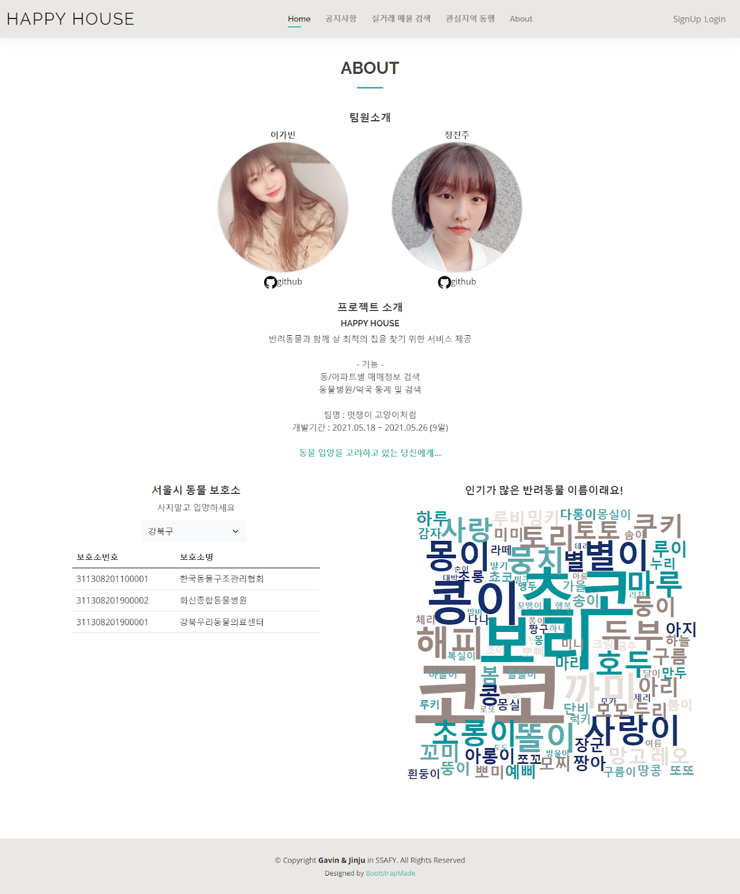

# HappyHouse

## 1. 프로젝트 소개

반려동물과 함께 살기 주거 환경의 아파트 매물을 찾을 수 있도록 기획한 웹 사이트입니다.

## 2. 주요 기능

#### 메인

- 상단 중앙 : Home, 공지사항, 실거래 매물검색, 관심지역 동행, About
- 상단 우측 : 회원가입, 로그인, 마이페이지, 로그아웃

#### 회원가입/마이페이지

- 회원가입 : 아이디 중복확인, 프로필 사진 첨부, 선호 지역 설정
- 마이페이지 : 회원 정보 수정, 회원 탈퇴

#### 공지사항

- 관리자(공통코드 이용) : 글 작성, 수정, 삭제
- 일반 사용자 : 글 조회 

#### 실거래 매물 검색

- 아파트 이름, 동 이름으로 검색 및 상세 정보 조회
- 지도 위치 표시

#### 관심 지역 동행

- 그래프 : 서울시 25개 구에 대한 동물 병원 및 동물 약국 현황

- 시/군/구 검색 : 셀렉트 박스 선택을 통한 동물 병원 및 약국 조회

  (선호 지역이 있을 경우 선호지역을 먼저 보여준다.)

#### About 

- 팀원 및 프로젝트 소개

- Hidden Page

  서울시 동물 보호소 목록(공공데이터 api 이용)

  동물 이름 워드 클라우드

## 3. 사용 기술

Front-End

- vue-cli, vue-router, vuex, axios, HTML5, CSS3, JavaScript, Bootstrap5

Back-End

- Springboot, gson, mybatis

## 4. DB ERD

## 5. 주요 화면

